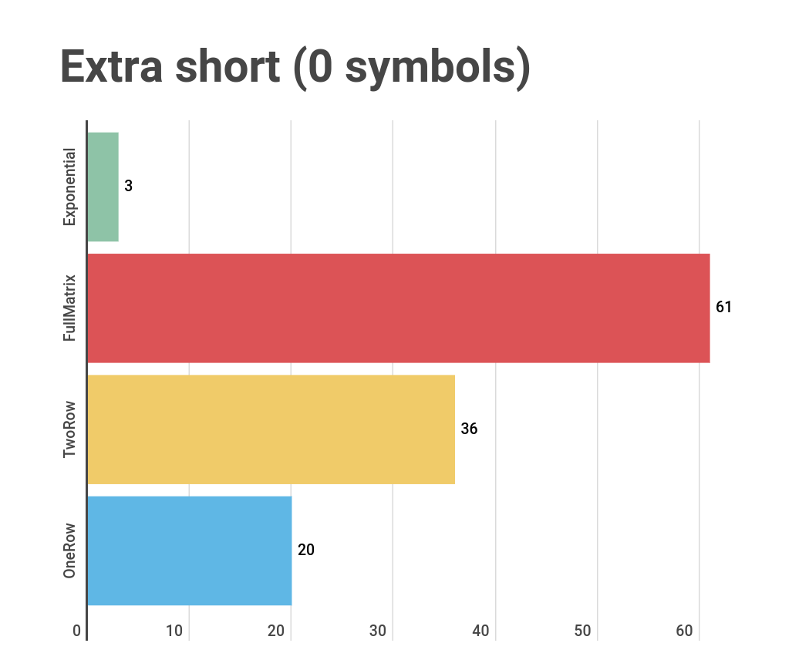
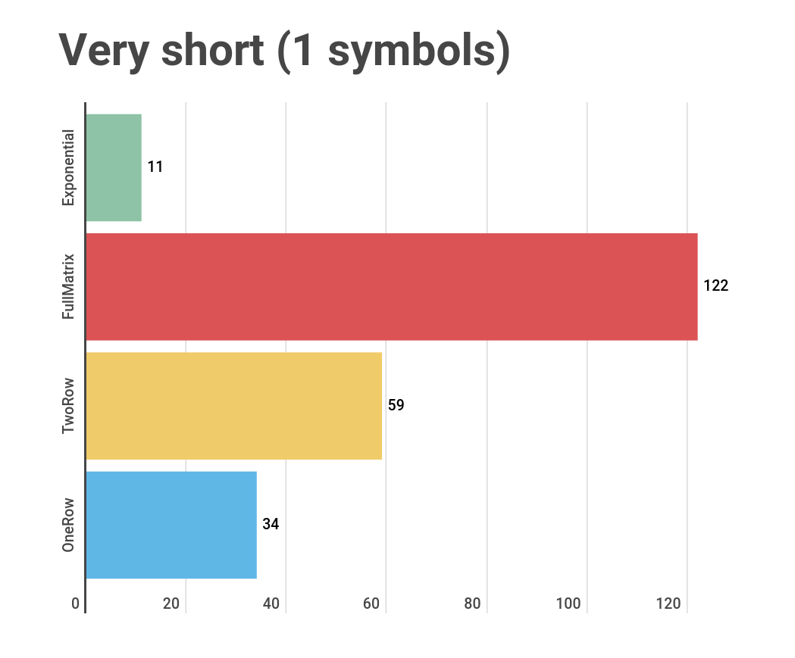
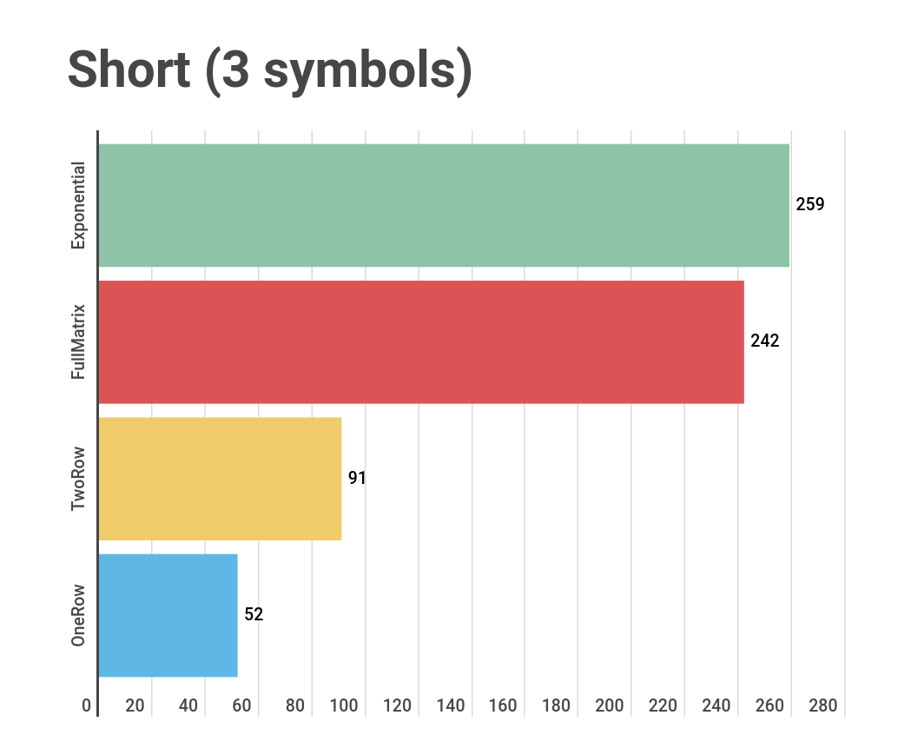
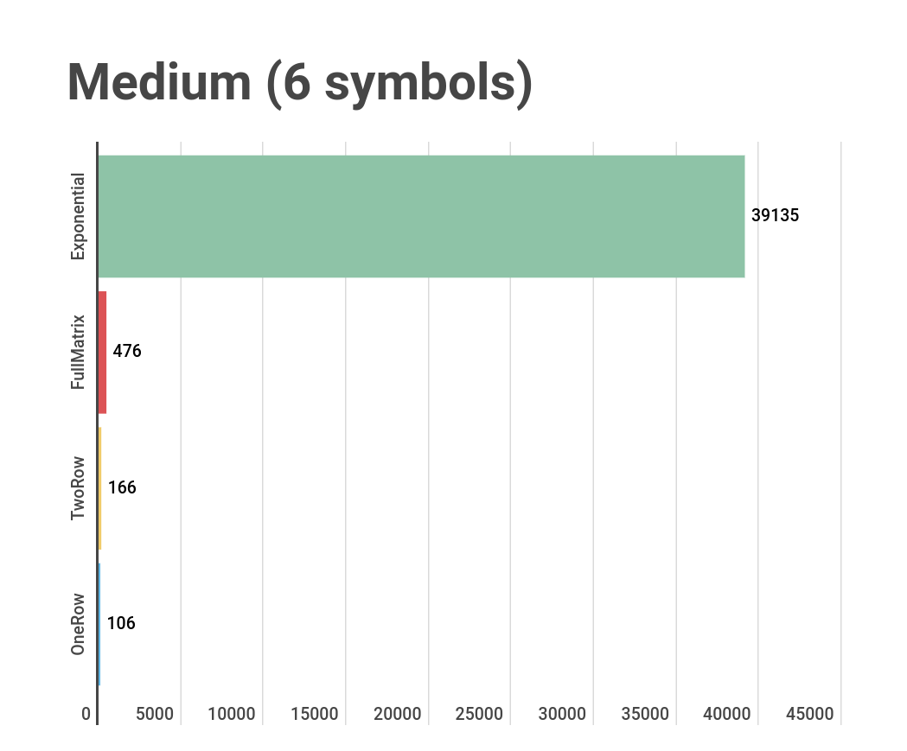
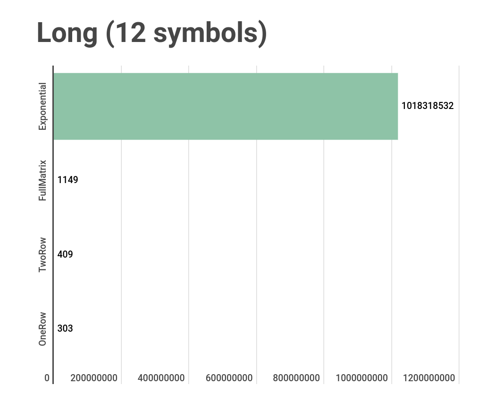
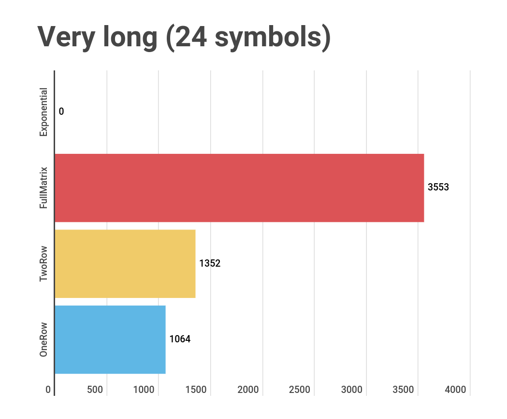

# levenshtein-algorithms

## Benchmarking
In order to run tests use:
```bash
go test -bench .
```

### Results
We use different length of input data in order to analyze the performance of the algorithms on different string lengths.

**Extra short string (0 symbols)**



**Very short string (1 symbols)**



**Short string (3 symbols)**



**Medium string (6 symbols)**



**Long string (12 symbols)**



**Very long string (24 symbols)**

